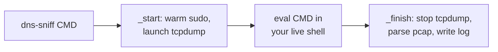

# dns-sniff

Wrap any command and log every DNS name it looks up, for building firewall or
proxy allowlists before running dev tools (terraform, pre-commit, pip) on
restricted corporate CI runners.

Deployed to `~/.zsh/bin/dns-sniff` (the capture engine) plus a zsh function of
the same name in `~/.zsh/custom/functions/dns-sniff.zsh` (the interactive front
end). Chezmoi-managed; source lives under `home/dot_zsh/`.

## Contents

- [Quick start](#quick-start)
- [How it works](#how-it-works)
- [Flags](#flags)
- [Interfaces and VPN](#interfaces-and-vpn)
- [Completeness and blind spots](#completeness-and-blind-spots)
- [Output](#output)
- [Requirements](#requirements)
- [Testing tips](#testing-tips)

## Quick start

```zsh
dns-sniff terraform init
dns-sniff --flush pre-commit run --all-files
dns-sniff -- curl -s https://example.com
```

Run it exactly as you would the wrapped command. Aliases and shell functions
resolve because the command runs in your live shell. It prints the DNS names to
the terminal and writes a timestamped `.dns.log` to the current directory.

## How it works

The name `dns-sniff` resolves to a zsh function (functions outrank `PATH`
commands), which drives the Python capture engine. The command runs in your
current shell via `eval`, so every alias, function, and plugin applies. A
backgrounded `sudo tcpdump` captures on the resolver's egress interface(s); the
engine then parses the pcap and writes the log.



Scripts and non-interactive shells bypass the function and hit the binary
directly, which runs the command itself as a fallback.

## Flags

Flags go before the command.

| Flag | Effect |
| --- | --- |
| `--flush` | Flush the DNS resolver cache first, forcing every name cold onto the wire. System-wide side effect. |
| `--pcap` | Also save the raw `.pcap` alongside the log. |
| `--no-log` | Print to stdout only; write no `.dns.log`. |
| `--log-dir PATH` | Directory for output files (default: current directory). |
| `--iface IFACE` | Force a capture interface, skipping auto-detection. |

## Interfaces and VPN

Capture works whether or not the VPN is up, by auto-detecting where DNS actually
egresses.

- macOS: route every `scutil --dns` nameserver to its interface and union with
  the default route. On a full-tunnel VPN that is the `utunN` tunnel; off VPN it
  is the physical interface (for example `en0`). The tunnel index drifts between
  connections, so it is never hardcoded.
- Linux: `tcpdump -i any`, which captures every interface at once.

Override with `--iface` if detection picks the wrong one.

## Completeness and blind spots

`dns-sniff` sees DNS on the wire. A name resolved without a wire query is
invisible to any packet-capture tool. Three cases produce no wire query:

| Cause | Effect | Mitigation |
| --- | --- | --- |
| Warm resolver cache | A cache hit answers locally | `--flush` forces it cold |
| GlobalProtect DNS Security, on VPN | GP answers some domains locally | Run off VPN or on the CI runner |
| Negative caching | An `NXDOMAIN` suppresses sibling queries | Use real, resolvable names |

For a complete allowlist, run with `--flush`. On a fresh CI runner the cache is
already cold, so every name hits the wire.

`--flush` is opt-in because it is machine-wide. macOS has no per-process DNS
cache, so flushing clears every app's cached entries and adds brief re-resolve
latency. On Linux it flushes `systemd-resolved` (`resolvectl flush-caches`) or
`nscd`; many Debian hosts run no local cache, where it is a harmless no-op.

## Output

Files land in the current directory, named `dns-<cmd>-<timestamp>`:

- `dns-<cmd>-<YYYY-MM-DD_HHMMSS>.dns.log` (default; skip with `--no-log`)
- `dns-<cmd>-<YYYY-MM-DD_HHMMSS>.pcap` (only with `--pcap`)

## Requirements

- `tcpdump`: built-in on macOS; `apt install tcpdump` on Debian (the dotfiles
  installer adds it under the `zsh` component).
- `sudo`: for raw socket access. Warmed once at startup and reused by teardown.

## Testing tips

Do not validate with a domain you have queried repeatedly (warm cache) or with
repeated bogus `NXDOMAIN` names under one parent (negative caching). Both look
like capture failures but are not. Validate with distinct, real, resolvable
domains spread over time, ideally with `--flush`:

```zsh
dns-sniff --flush -- sh -c '
  for d in example.org example.net iana.org debian.org; do
    curl -s -o /dev/null "https://$d"; sleep 1
  done'
```
